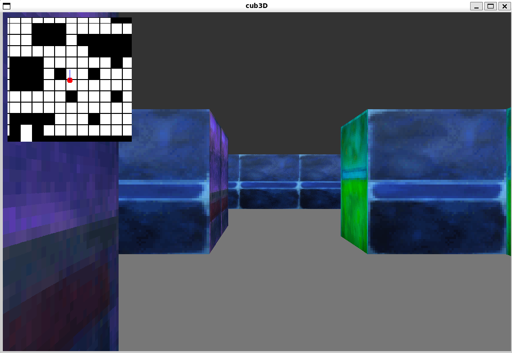

# Cub3D




## Skills

- **Collaborative Software Development with Git**: Advanced use of Git for version control, team collaboration, and effective conflict resolution.
- **C Programming**: Implementation of complex software architecture in C, memory management, code optimization, and adherence to coding standards.
- **3D Rendering with Ray-Casting**: Mastery of advanced ray-casting techniques to simulate realistic 3D environments from 2D data.
- **Use of MinilibX**: Integration of a low-level graphics library for real-time graphical rendering.
- **File Parsing and Management**: Analysis and processing of .cub configuration files for dynamic 3D scene generation.
- **Optimization and Performance**: Optimization of graphical rendering and algorithms to ensure smooth user experience.
- **System Event Handling**: Implementation of window management and user event handling for intuitive user interaction.
- **Testing and Debugging**: Development of rigorous testing strategies and efficient error resolution to ensure software reliability.


## Project Overview

Cub3D, developed in C with MinilibX, draws inspiration from classic first-person shooters like Wolfenstein 3D. It immerses users in a 3D maze environment using ray-casting for real-time rendering. Project challenges included parsing scene descriptions, rendering textured walls, implementing player movement controls, and efficient window management, and as a bonus a small 2D minimap, for localize you in the maze.

This project is the sequel to a first successful collaboration between [Stephane Payeur](https://github.com/s-payeur) and myself — apparently lightning does strike twice! — showcasing our ability to deliver outstanding outcomes ;).


## Features

- **Real-time 3D Rendering**: Utilizes ray-casting to display a 3D perspective within a maze environment.
- **Texture Mapping**: Differentiates walls based on cardinal directions (North, South, East, West) using specified textures.
- **Player Controls**: Allows movement (forward, backward, strafe) and camera rotation (left, right) via keyboard inputs.
- **Dynamic Window Management**: Handles window events such as minimizing, restoring, and closing smoothly.


## Content

- **Makefile**: Compilation and project organization.
- **PixelTexturePack/**: Organized texture pack by type.
- **basic.cub**: A map file to use with the executable.
- **includes/**: header file cub3d.h.
- **libft/**: Library with utility functions in C.
- **miniLibX/**: MiniLibX for window management and rendering.
- **srcs/**: Project source code, organized into functional modules.


## Usage

1. ### Installation
Ensure MinilibX is installed along with required system libraries:
```bash
    sudo apt-get update
    sudo apt-get install libx11-dev libxext-dev
    sudo apt-get install libbsd-dev
```

2. ### Compilation
Compile the project using the provided Makefile:
```bash
    make
```

3. ### Execution
Run the program with a .cub file specifying the map:

```bash
./cub3D path_to_your_map.cub
```

### Commands
**Escape** exit cleanly
**Left Arrow**: Rotate left  
**Right Arrow**: Rotate right  
**W**: Move forward  
**S**: Move backward  
**A**: Move left  
**D**: Move right  


## Links

- [An amazing Cub3D with an interresting README.md](https://github.com/iciamyplant/Cub3d-Linux)
- [Make our own Raycaster course](https://www.youtube.com/watch?v=gYRrGTC7GtA)
- [Pixel drawing with MinilibX](https://aurelienbrabant.fr/blog/pixel-drawing-with-the-minilibx)
